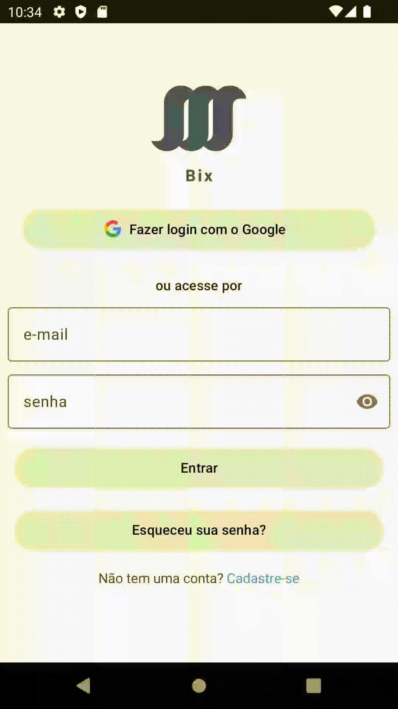

<h4 align="center"> 
    
</h4>

# Índice 
* [Índice](#índice)
* [Descrição do projeto](#descrição-do-projeto)
* [Status do projeto](#status-do-projeto)
* [Funcionalidades e demonstração da aplicação](#funcionalidades-e-demonstração-da-aplicação)
* [Acesso ao projeto](#acesso-ao-projeto)
* [Abrir e rodar o projeto](#abrir-e-rodar-o-projeto)
* [Tecnologias utilizadas](#tecnologias-utilizadas)
* [Contato](#contato)

# Descrição do projeto
O projeto esta sendo desenvolvido com base nas redes sociais utilizadas atualmente, implementando funcionalidades e aspectos 
que remetem a uma boa interação com o usuário final.

# Status do projeto

# Funcionalidades e demonstração da aplicação

### Cadastro através de email/senha - Firebase

### Login através de email/senha - Firebase

### Recuperação de senha (através de envio de e-mail) - Firebase

### Login através do Google One Tap - Firebase

# Acesso ao projeto
Para acessar o projeto, [clique aqui](https://github.com/matheusfinamor1/Projeto-Bix/tree/main), onde você será redirecionado
para a branch principal do projeto.

# Abrir e rodar o projeto

## :heavy_exclamation_mark: Atenção! :heavy_exclamation_mark:
No projeto, por motivos de segurança, **não** se encontra o arquivo google-services.json, obtido quando se fez a configuração do Firebase para o projeto.
Para utilizar as funcionalidades do Firebase no projeto, configure o Firebase em uma conta sua, ative a ferramente **Authentication** e habilite as opções de login por
email/senha e Google, só assim, será possível utilizar as funcionalidades do Firebase contidas no projeto.

## :gift: Dica :gift:
Para ter a melhor experiência possível no projeto, utilize a IDE **Android Studio** na sua versão **estável** mais recente.

## Para abrir e rodar o projeto, há duas opções:
### Clone do projeto
Para realizar o clone do projeto, clique em **Code**(no link de acesso ao projeto) e escolha uma das opções presentes: **HTTPS, SSH ou GitHub CLI**, após isso, faça a configuração necessária na IDE para rodar o projeto.
### Download do projeto
Para realizar o download do projeto, clique em **Code**(no link de acesso ao projeto) e escolha a opção **Download ZIP**, após isso, extraia os arquivos baixados para uma pasta e rode o projeto na IDE.

# Tecnologias utilizadas
- `Android Studio`
- `Kotlin`
- `Firebase`
- `POO`
- `Jetpack Compose`
- `Design Patterns`
- `Clean Architecture`

# Contato
Para mais informações sobre o mesmo, feedbacks ou dúvidas, entre em contato pelo [Linkedin](https://www.linkedin.com/in/matheus-finamor/) ou pelo email **matheusfinamor1@gmail.com**
